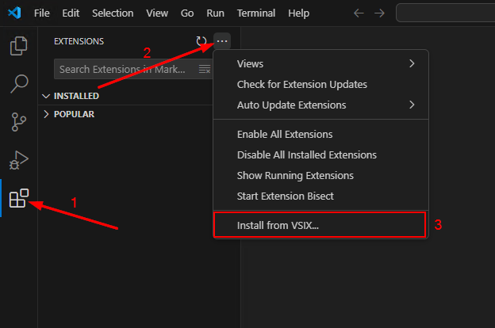
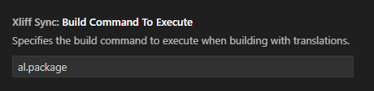

# XLIFF Sync Improved

## Installation

Then choose the `xliff-sync.vsix` file

## Added Settings & Features

### Default Languages
Xliff file generation now uses the languages defined in this Setting

### Build Command To Execute
When using the new Command `Build with Translations` the command specified in this Setting will be used for building the App

### Build with Translations
This new command (Shortcut: Ctrl+Shift+T) combines all actions into one command:
> 1. Delete current translation files
> 2. Build App using the build command defined in new Setting `Build Command To Execute`
> 3. Create new Target files for Languages defined in new Setting `Default Languages`
> 4. Syncs Translations files to show if translations are missing

To use this, a file from the App for which you want to update the Translations has to be opened. Then execute the command.

## Recommended Settings

### Files: Associations
Recommended setting this to

| Item | Value |
| ---- | ----- |
| *.xlf | plaintext |

This improves the general performance of the Xliff file generation at the Cost of not having a color applied to the content of the Xliff files

