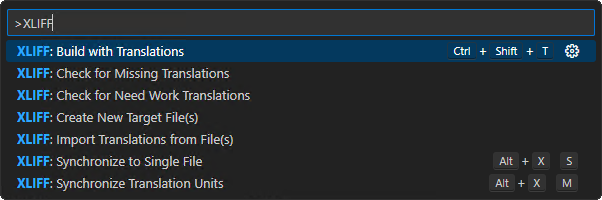
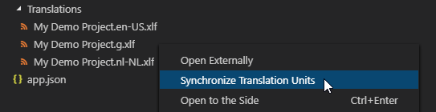
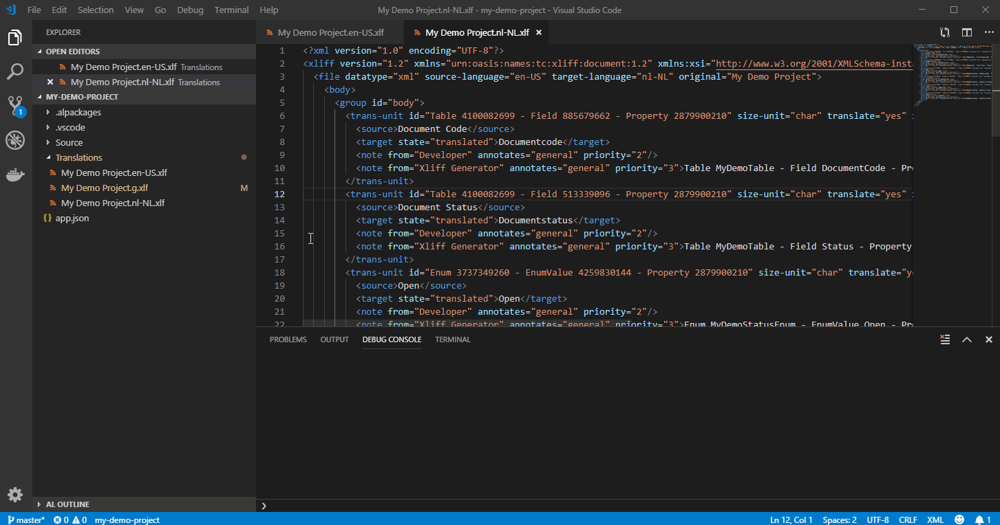
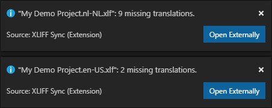
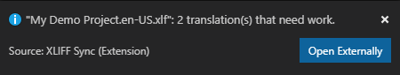

# XLIFF Sync

 

A VSCode extension to keep XLIFF translation files in sync with a specified, automatically generated base-XLIFF file.

This project originated from the need for a tool to automatically merge/synchronize XLIFF translation files that are in the OASIS specification.
This extension is based on the [Angular Localization Helper](https://github.com/manux54/vsc-angular-localization-helper) developed by [manux54](https://github.com/manux54), which has been extended so that it can also be used to synchronize files from other XLIFF generators.
It is specifically targeted at synchronizing trans-units from an `<ApplicationName>.g.xlf` file automatically generated by the [AL Language](https://marketplace.visualstudio.com/items?itemName=ms-dynamics-smb.al) extension that can be used to develop extensions for Microsoft Dynamics 365 Business Central.
Apart from synchronizing trans-units from a base-XLIFF file, this extension contributes various other features, including commands to check for missing translations, detect problems in translations and import translations from external XLIFF files.

* [Features](#features)
* [Contributions](#contributions)
  * [Commands](#commands)
  * [Settings](#settings)
* [Usage](#usage)
  * [Synchronize to Single File](#synchronize-to-single-file)
  * [Synchronize Translation Units](#synchronize-translation-units)
  * [Check for Missing Translations](#check-for-missing-translations)
  * [Check for Need Work Translations](#check-for-need-work-translations)
  * [Find Next Missing Translation in XLIFF File](#find-next-missing-translation-in-xliff-file)
  * [Find Next Needs Work Translation in XLIFF File](#find-next-needs-work-translation-in-xliff-file)
  * [Import Translations from File(s)](#import-translations-from-files)
* [Known Issues](#known-issues)

## Features

* Merge new translations from a generated, base-XLIFF file into existing XLIFF files.
  - Merge from the base-XLIFF file into a manually specified target XLIFF file.
  - Merge from the base-XLIFF file into all XLIFF files in the open workspace.
* Search and highlight missing translations in an open XLIFF file.
* Run technical validations to check for problems in the translations of target XLIFF files.
* Import/Copy translations for matching sources from external XLIFF files to target XLIFF files.
* Support for XLIFF 1.2 and 2.0
* Convert between XLIFF 1.2 and 2.0 format.

## Contributions

### Commands

| Command | Explanation |
| ------- | ----------- |
| **XLIFF: Synchronize to Single File** | Merge new trans-units from base-XLIFF file into a manually specified target XLIFF file. |
| **XLIFF: Synchronize Translation Units** | Merge new trans-units from base-XLIFF file into all other XLIFF files in the open project folder. |
| **XLIFF: Check for Missing Translations** | Checks if there are any missing translations in the target XLIFF files in the open project folder. For each file with missing translations, an informational message will be shown (with a button to open the file externally). |
| **XLIFF: Check for Need Work Translations** | Checks if there are translations that need work in the target XLIFF files in the open project folder. For example, the source text contains placeholders (e.g., "%1" or "{0}") while the translation does not. Translations with problems will be tagged with `needs-adaptation`. For each file with translations that need work, an informational message will be shown (with a button to open the file externally). |
| **XLIFF: Next Missing Translation** | In an XLIFF file that is currently opened in the active editor, search for the next missing translation. |
| **XLIFF: Next Needs Work Translation** | In an XLIFF file that is currently opened in the active editor, search for the next translation tagged as `needs-adaptation`. |
| **XLIFF: Import Translations from File(s)** | Import/Copy translations from external XLIFF files to trans-units with matching sources of target XLIFF files with the same target-language. |

### Settings

| Setting | Default | Explanation |
| ------- | ------- | ----------- |
| xliffSync.baseFile | `application.g.xlf` | Specifies which XLIFF file to use as the base (e.g., the generated XLIFF). If the file does not exist, you will be prompted to specify the file to use as base-XLIFF file the first time you use the Synchronize command. |
| xliffSync.fileType | `xlf` | The file type (`xlf` or `xlf2`). |
| xliffSync.missingTranslation | `%EMPTY%` | The placeholder for missing translations for trans-units that were synced/merged into target XLIFF files. You can use `%EMPTY%` if you want to use an empty string for missing translations. |
| xliffSync.findByXliffGeneratorNoteAndSource | `true` | Specifies whether or not the extension will try to find trans-units by XLIFF generator note and source. |
| xliffSync.findByXliffGeneratorAndDeveloperNote | `true` | Specifies whether or not the extension will try to find trans-units by XLIFF generator note and developer note. |
| xliffSync.findByXliffGeneratorNote | `true` | Specifies whether or not the extension will try to find trans-units by XLIFF generator note. |
| xliffSync.findBySourceAndDeveloperNote | `false` | Specifies whether or not the extension will try to find translations by the combination of source and developer note. |
| xliffSync.findBySource | `false` | Specifies whether or not the extension will try to find translations by source. If there are multiple trans-units with the same source, then the translation of the first translation unit is used for all units. |
| xliffSync.developerNoteDesignation | `Developer` | Specifies the name that is used to designate a developer note. |
| xliffSync.xliffGeneratorNoteDesignation | `Xliff Generator` | Specifies the name that is used to designate a XLIFF generator note. |
| xliffSync.autoCheckMissingTranslations | `false` | Specifies whether or not the extension should automatically check for missing translations after syncing. |
| xliffSync.autoCheckNeedWorkTranslations | `false` | Specifies whether or not the extension should automatically run a technical validation on translations after syncing |
| xliffSync.needWorkTranslationRules | `["OptionMemberCount", "OptionLeadingSpaces", "Placeholders"]` | Specifies which technical validation rules should be used. |
| xliffSync.preserveTargetAttributes | `false` | Specifies whether or not syncing should use the attributes from the target files for the trans-unit nodes while syncing. |
| xliffSync.preserveTargetAttributesOrder | `false` | Specifies whether the attributes of trans-unit nodes should use the order found in the target files while syncing. |
| xliffSync.replaceTranslationsDuringImport | `false` | Specifies whether existing translations will be replaced when the XLIFF: Import Translations from File(s) command is run. |
| xliffSync.decoration | `{"backgroundColor": "rgba(240, 210, 105, 0.35)", "overviewRulerColor": "rgba(240, 210, 105, 0.35)", "border": "1px solid white", "borderRadius": "4px"}` | Specifies how to highlight missing translations or translations that need work in an XLIFF file opened in the editor. |

## Usage

The extension will try to find corresponding trans-units and translations within an existing file as follows:

1. Finding trans-units:
> 1. By Id
> 2. By XLIFF Generator Note & Source (enabled by default, configurable)
> 3. By XLIFF Generator Note & Developer Note (enabled by default, configurable)
> 4. By XLIFF Generator Note (enabled by default, configurable)

2. Finding translations:
> 5. By Source & Developer Note (disabled by default, configurable)
> 6. By Source (disabled by default, configurable)

If no trans-unit is found, the unit is added and its target node is tagged with `state="needs-translation"`.

### Synchronize to Single File

#### Using the Command Palette
> 1. F1 or Ctrl/Cmd + Shift + P to open the command palette
> 2. **XLIFF: Synchronize to Single File**

#### Using keyboard shortcut

> 1.  Alt + X, S (default shortcut)

By default, the extension expects the base-XLIFF file to be named `application.g.xlf`.
If no matching file is found, you are prompted to identify the base file.
This setting will be saved for future use. If the extension is invoked from a localization file, that file will be updated, otherwise the extension will prompt you for the file to update.

You can also use this command to create a new XLIFF file for a language.
For this, choose the "New File..." option and enter the region/language code for the target language.

### Synchronize Translation Units

#### Using the Command Palette

> 1. F1 or Ctrl/Cmd + Shift + P to open the command palette
> 2. **XLIFF: Synchronize Translation Units**

*NOTE*: This command will merge new translations into all XLIFF files in your workspace folder (with, obviously, excluding the base-XLIFF file itself).

#### Using keyboard shortcut

> 1.  Alt + X, M (default shortcut)

#### From the Explorer

> 1. Right-click on a file with the .xlf extension.
> 2. Select: **Synchronize Translation Units**

If you select the base-XLIFF file, then translation units will be synced to all other XLIFF files in the workspace.
If you select any other XLIFF file, then translation units will be synced from the base-XLIFF file to the selected file.

Here's a small demo:

### Check for Missing Translations

#### Using the Command Palette

> 1. F1 or Ctrl/Cmd + Shift + P to open the command palette
> 2. **XLIFF: Check for Missing Translations**

This will check all XLIFF files in the workspace and notify about any missing translations in the files.
You also have the option to open files with missing translations with your default XLIFF editor using the **Open Externally** button from the informational message.

### Check for Need Work Translations

#### Using the Command Palette

> 1. F1 or Ctrl/Cmd + Shift + P to open the command palette
> 2. **XLIFF: Check for Need Work Translations**

This will run technical validation/checks for all XLIFF files in the workspace and notify about any translations that need work in the files.
You also have the option to open files containing problems with your default XLIFF editor using the **Open Externally** button from the informational message.

The target node of the trans-units containing problems will be tagged with `state="needs-adaptation"`.
Additionally, a `note` will be added to the trans-unit to explain which problem was detected.
When you run the command again after resolving the issue, then this note will be automatically removed.

You can configure the checks that need to be run with the `xliffSync.needWorkTranslationRules` setting.
The currently implemented checks are the following:

| Rule ID               | Check                                                                                                     | Trigger                                                                                    | Example                                                                                                            |
|-----------------------|-----------------------------------------------------------------------------------------------------------|--------------------------------------------------------------------------------------------|--------------------------------------------------------------------------------------------------------------------|
| `OptionMemberCount`   | Number of options in caption are not matching.                                                            | Xliff Generator note with `Property OptionCaption` or `Property PromotedActionCategories`. | The source text includes 3 options, `A,B,C` , but the translation text includes 4 options, `A,B,C,D`.              |
| `OptionLeadingSpaces` | Number of leading spaces in options are not matching.                                                     | Xliff Generator note with `Property OptionCaption` or `Property PromotedActionCategories`. | The source text includes a space, `A, B` , but the translation text does not, `A,B`.                               |
| `Placeholders`        | Placeholders of source and translation are not matching.                                                  | Source/Translation text includes placeholders of the form `{0}` or `%1`.                   | The source text includes placeholders `%1 %2` , but the translation text only includes `%1`.                       |
| `SourceEqualsTarget`  | Source and translation are not the same, even though source-language = target-language for the .xlf file. | The source-language is the same as the target-language for the .xlf file.                  | The source text is 'A', but the translation text is 'B'. The source-language and target-language are both 'en-US'. |

### Find Next Missing Translation in XLIFF File

#### Using the Command Palette

> 1.  F1 or CMD + Shift + P to open the command palette
> 2.  **XLIFF: Next Missing Translation**

#### Using keyboard shortcut

> 1.  Alt + X, N (default shortcut)

Missing translations are tagged and highlighted.
You can use the extension to navigate between missing translations.
On a Macbook Pro, this command appears on the touchbar within XLIFF files.

### Find Next Needs Work Translation in XLIFF File

#### Using the Command Palette

> 1.  F1 or CMD + Shift + P to open the command palette
> 2.  **XLIFF: Next Needs Work Translation**

#### Using keyboard shortcut

> 1.  Alt + X, W (default shortcut)

Translations that need work are tagged and highlighted.
You can use this command to navigate between translations that need work.
On a Macbook Pro, this command appears on the touchbar within XLIFF files.

### Import Translations from File(s)

#### Using the Command Palette

> 1. F1 or Ctrl/Cmd + Shift + P to open the command palette
> 2. **XLIFF: Import Translations from File(s)**

This will open a file dialog in which you can select one or more XLIFF files (.xlf or .xlf2).
The command will copy translations from the selected files to trans-units in the XLIFF files in your project folder with the same target-language for matching sources.
It will try first to merge translations for trans-units with a matching combination of source-text and Developer note, and only after that try to merge translations to trans-units with matching source-text.
That way you could utilize the Developer note to have the import perform a more precise merge of the translations (e.g., based on tags in the Developer notes).

## Known Issues

* Support for group nodes and automatically inserting new groups into target files is not implemented.
* The NAV2018 XLIFF generator creates Xliff Generator Notes without any identifiers, therefore it is recommended to change the `xliffSync.findBy...` settings to not synchronize trans-units based on Xliff Generator notes.
